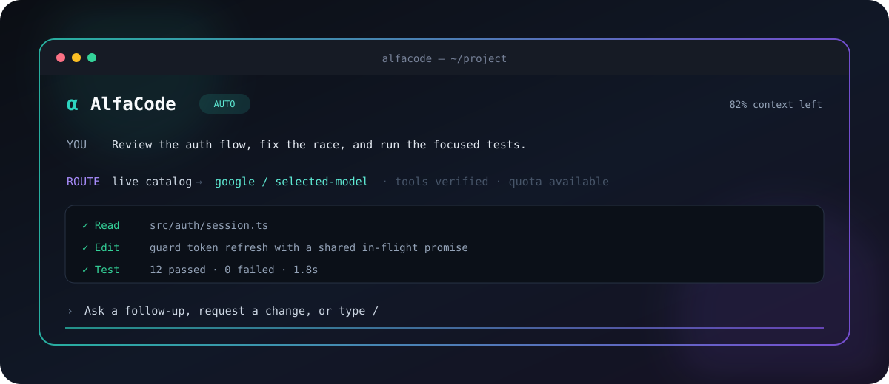

<div align="center">
  

  <p><strong>A polished, multi-provider AI coding agent for the terminal.</strong><br />
  Keep the Claude Code execution engine. Choose the models and providers.</p>

  <p>
    <a href="https://github.com/alfanowski/AlfaCode/actions/workflows/checks.yml"></a>
    <a href="LICENSE"></a>
    
    
  </p>
</div>

AlfaCode is an independent terminal coding agent with its own native TUI, secure provider manager, dynamic model catalog, usage tracking, and multi-provider gateway. Underneath, it runs an exact-pinned Claude Agent SDK/Claude Code engine so tools, permissions, sessions, subagents, skills, and project settings keep Claude Code semantics.

```text
AlfaCode TUI  →  pinned Claude Code engine  →  local secure gateway  →  your providers
```

Your normal `claude` installation is left untouched. AlfaCode has its own command, configuration, sessions, model state, credential references, and usage ledger.

> [!IMPORTANT]
> AlfaCode is independent, alpha software. It is not affiliated with, endorsed by, or supported by Anthropic, OpenCode, Google, or any model provider. Compatibility with non-Claude models is implemented by AlfaCode and is not guaranteed by Anthropic.

## Why AlfaCode

| | What you get |
| --- | --- |
| **One coding agent, many providers** | Connect Google AI Studio, OpenCode Zen, Anthropic, OpenAI-compatible endpoints, and dynamically discovered compatible providers at the same time. |
| **No hardcoded model list** | Provider catalogs are refreshed at runtime. New models appear automatically; removed models stop being routed. |
| **Real tool calling** | Provider-native adapters preserve function calls, tool results, streaming, reasoning state, and continuation metadata instead of flattening everything into text. |
| **Automatic model selection** | AlfaCode ranks the combined live catalog using provider-reported capacity when available, proven compatibility, local usage, failures, and fair scheduling. |
| **A native terminal experience** | Markdown, searchable command and model palettes, contextual suggestions, permission cards, interactive questions, token usage, context left, themes, and motion. |
| **Credentials stay out of chat** | Keys are entered through a masked setup TUI and stored in macOS Keychain, or referenced through environment variables for automation. |

## Product tour

- Type `/` for a filtered command palette without leaving the conversation.
- Use `/model` to search every currently callable model across every connected provider.
- Use `/providers` to connect, reconnect, select, inspect, or delete providers.
- See exact engine context left and locally recorded token usage after each turn.
- Render terminal-safe Markdown: headings, emphasis, quotes, task lists, links, code fences, line numbers, and responsive tables.
- Answer tool-driven questions through single choice, multiple choice, previews, custom answers, and consecutive question flows.
- Watch tool calls and subagents live, with the same structured engine contracts used by Claude Code.
- Switch between four built-in themes with `/theme` — dark, light, and colorblind-friendly ("daltonized") dark/light variants built on the Okabe–Ito palette; animation automatically respects reduced-motion and non-interactive environments.
- Get a terminal bell (and, opt-in, a macOS notification) when a response finishes or a permission prompt is waiting.
- Export the current conversation to a Markdown file with `/export`.

## Quick start

### Requirements

- **macOS** — the currently supported and tested interactive platform
- **Node.js 24 or newer** — check with `node --version`
- **pnpm 10 or newer** — check with `pnpm --version`
- **Git**

If pnpm is missing and Corepack is available:

```bash
corepack enable pnpm
```

### Install from source

AlfaCode is not published to npm yet. The repository installer builds the exact checkout and creates a small launcher in `~/.local/bin`; it does not use `sudo` or change your shell configuration.

```bash
git clone https://github.com/alfanowski/AlfaCode.git
cd AlfaCode
./scripts/install.sh
```

Then start it:

```bash
alfacode
```

If your shell cannot find the command, add the local bin directory to `PATH` once:

```bash
echo 'export PATH="$HOME/.local/bin:$PATH"' >> ~/.zshrc
exec zsh
```

> [!TIP]
> Prefer a different launcher directory? Run `./scripts/install.sh --bin-dir /your/directory`. AlfaCode will refuse to overwrite an unrelated command unless you explicitly add `--force`.

### First launch

The first launch opens AlfaCode's provider setup inside the TUI:

1. Choose a provider.
2. Choose its access mode.
3. Paste the API key when required. The field is masked and clearly labelled.
4. AlfaCode verifies the connection and discovers the live model catalog.
5. Add more providers at any time with `/connect` or manage them with `/providers`.

For a zero-key first run, choose **OpenCode Zen → Free public models**. To use Google, create a key in [Google AI Studio](https://aistudio.google.com/apikey), then choose **Google AI Studio** and paste that key into the secure field.

## Providers

| Provider | Authentication | Discovery and transport |
| --- | --- | --- |
| **Google AI Studio** | API key | Native Gemini Generate Content adapter, live account discovery, availability probes, tool calls, and thought-signature replay. |
| **OpenCode Zen** | Free public access or optional Zen API key | Live catalog with explicit per-model protocol metadata. Anonymous access only admits models currently marked free and tool-capable. |
| **Anthropic** | API key | Native Anthropic Messages transport and account-scoped discovery. |
| **OpenAI-compatible** | Base URL and API key reference | Dynamic `/models` discovery with OpenAI Chat Completions or Responses transport when capability metadata proves the route. |
| **models.dev catalog connectors** | Provider-dependent | Provider and protocol metadata refreshed dynamically; no bundled model IDs or credentials. |

All configured providers remain active simultaneously. A preferred provider is only an explicit pin; it does not disable the rest of the catalog.

AlfaCode never guesses a protocol from a model name. Models with incomplete tool or transport metadata remain visible for diagnostics but are not silently auto-selected. A 404 removes a model from consideration; a 429 or retryable 5xx starts a cooldown and can fail over before any response content is emitted.

> [!NOTE]
> Some providers do not expose exact remaining quota. For example, Google AI Studio's model API does not report remaining RPM/TPM/RPD. AlfaCode reports that capacity as unknown instead of inventing a percentage.

### Non-interactive configuration

Reference an environment variable when running in CI or when you do not want to store a key in Keychain:

```bash
export GEMINI_API_KEY="your-key"
alfacode connect google --id google-personal --api-key-env GEMINI_API_KEY
```

Additional examples:

```bash
# OpenCode Zen public access; no key or billing setup
alfacode connect zen

# Anthropic through an environment variable
alfacode connect anthropic --id anthropic-work --api-key-env ANTHROPIC_API_KEY

# A custom OpenAI-compatible endpoint
alfacode connect openai-compatible \
  --id local-gateway \
  --base-url http://127.0.0.1:4000/v1 \
  --api-key-env LOCAL_API_KEY
```

For scripted sessions, put `--` before arguments intended for the engine:

```bash
alfacode run --non-interactive -- -p "Run the test suite and explain any failures"
```

## Inside the TUI

| Command | Action |
| --- | --- |
| `/model` | Search and switch across the combined live model catalog. |
| `/providers` | Inspect, select, reconnect, and delete provider connections. |
| `/connect` | Add another provider without exposing its credential to chat. |
| `/usage` | Inspect context and locally recorded token usage. |
| `/context` | Alias for `/usage`'s context-window breakdown. |
| `/compact [instructions]` | Ask the engine to summarize the conversation and free up context. |
| `/agents` | List the subagents exposed by the pinned engine. |
| `/mcp` | Show configured MCP servers, their connection status, and tool counts. |
| `/permissions` | Change the tool permission mode. |
| `/vim` | Toggle vim-style modal editing in the composer. |
| `/theme` | Switch between dark, light, and colorblind-friendly ("daltonized") themes. |
| `/spellcheck [on\|off\|checker <name>\|dictionary <code>\|color <name>]` | Toggle or configure composer spell-checking. |
| `/export` | Export the current transcript to a Markdown file under `~/.alfacode/exports/`. |
| `/clear` | Clear the visible transcript. |
| `/help` | Show commands and keyboard shortcuts. |
| `/exit` | Close AlfaCode cleanly. |

The composer supports cursor editing, multiline input, paste, prompt history, common Unix editing shortcuts, filtered slash commands, and engine-generated follow-up suggestions accepted with `Tab`. It also supports:

- **Vim mode** — `/vim`, or set `ALFACODE_VIM_MODE=1`, for modal NORMAL/INSERT/VISUAL editing: `hjkl`, `w`/`b`/`e`, `0`/`$`, `gg`/`G` motions; `x`, `dd`, `dw`, `cc`, `cw`, `yy`/`p`, `u` edits (and the operator table composes further, e.g. `d$`, `yG`, `cj`).
- **`@` file mentions** — type `@` for a filtered, navigable popup of files/directories under the working directory (same navigate/tab pattern as the `/` command palette).
- **Image paste** — `Ctrl+V` (or `Cmd+V` on terminals that support the kitty keyboard protocol) attaches whatever image is on the system clipboard, shown in the composer as `[Image #N]`.
- **Drag-and-drop** — dropping a file onto the terminal (delivered by most terminals as a pasted path) is detected and turned into an `@`-mention, or attached directly if it's an image.
- **`Ctrl+R`** — reverse-search the prompt history without leaving the composer.
- **Spell-check underlines** — misspelled words underline live in the composer when `/spellcheck` is enabled (see [Spell-check](#spell-check) below).

During a turn, `Ctrl+O` toggles a detailed view of the focused tool call's input/output, and `Ctrl+T` collapses or expands the live task list when the engine reports one (`TodoWrite`). A separate panel shows any backgrounded work. On a permission prompt, `Tab` attaches a short free-text note to your decision, recorded in the visible transcript for an audit trail.

### Sessions & checkpoints

- `alfacode --continue` (or `-c`) resumes the most recent session for the current directory; `alfacode --resume [name|id]` resumes a specific one, opening a picker when the query is ambiguous — see `alfacode sessions` below. `--name <title>` names a session as it starts.
- Double-`Esc` on an empty prompt opens a rewind menu: pick an earlier prompt to restore tracked file edits (via the engine's own file-checkpointing) and truncate the visible transcript back to that point, with the original prompt text restored to the composer for editing and resending.
- Context-remaining is shown live in the composer and in full via `/usage`; AlfaCode nudges you toward `/compact` once the engine's own auto-compact threshold (or an 80% fallback) is crossed.

### Themes

`/theme` opens a live picker across four built-in themes: `dark`, `light`, `dark-daltonized`, and `light-daltonized`. The daltonized variants use hues from the Okabe–Ito color-universal-design palette and avoid pairing red against green for success/warning/danger, so they stay distinguishable under the common forms of color-blindness. Set `ALFACODE_THEME` (any of the four names) to choose one non-interactively at launch; otherwise AlfaCode infers dark or light from `COLORFGBG`. Theme selection made through `/theme` is session-scoped — it does not persist across restarts.

### Notifications

AlfaCode rings the terminal bell (`\x07`) when a response finishes or a permission prompt starts waiting — on by default, disable with `ALFACODE_NOTIFY_BELL=0`. Most macOS terminals (Terminal.app, iTerm2, Ghostty, …) already turn an unfocused bell into a dock badge or banner when that terminal preference is enabled, so this is the practical way to get "notify me when I'm not looking" without AlfaCode guessing at window focus. Set `ALFACODE_NOTIFY_DESKTOP=1` to additionally fire a best-effort macOS notification (`osascript -e 'display notification …'`); it is off by default, non-blocking, and a failure to notify never affects the session.

### MCP servers

`/mcp` shows the MCP servers configured for the current session — name, connection status (`connected`, `pending`, `needs-auth`, `failed`, `disabled`), and tool count — sourced live from the pinned engine. AlfaCode does not manage MCP servers itself; configure them the same way you would for Claude Code (project `.mcp.json`, user settings, etc.).

### Spell-check

`/spellcheck` toggles opt-in composer spell-checking (off by default). It requires `aspell`, `hunspell`, or `ispell` on `PATH` — detected automatically, or pick one with `/spellcheck checker <name>`. Misspelled words underline live in the composer after a short pause in typing; code-looking tokens, URLs, CLI flags, camelCase/PascalCase identifiers, and backtick-quoted text are skipped. `/spellcheck dictionary <code>` sets the dictionary (e.g. `en_US`) and `/spellcheck color <name>` sets the underline color. The preference is stored locally, independent of `~/.alfacode/config.json`.

### Fullscreen mode

`--fullscreen` renders the chat UI on the terminal's alternate screen buffer (like vim or htop) with a fixed-bottom composer, using Ink's native support so the terminal is restored correctly even on a crash or `Ctrl+C`. `PageUp`/`PageDown` scroll by roughly a screen's worth of rows; `Ctrl+Home`/`Ctrl+End` jump to the oldest or newest message. A "N new messages below" indicator appears when scrolled away from the tail; nothing auto-jumps back to the bottom while you're reading history. Mouse support and in-transcript search are not implemented yet.

### Screen-reader mode

`--screen-reader` (or `ALFACODE_SCREEN_READER=1`; Ink's own `INK_SCREEN_READER=true` is also honored) switches to a plain, linear, screen-reader-friendly UI: an append-only transcript with textual role labels instead of box-drawing and in-place redraws, numbered alternatives on every picker (type the number shown, in addition to arrow keys), typed `y`/`n`/`a` alternatives on permission prompts, and a terminal bell on response completion, permission prompts, and tool calls that run past a few seconds.

## CLI reference

```text
alfacode                              Start the native AlfaCode TUI
alfacode --continue, -c               Resume the most recent session in this directory
alfacode --resume, -r [name|id]       Resume a specific session, prompting if ambiguous
alfacode --name <title>               Name the session as it starts
alfacode --fullscreen                 Render on the alternate screen buffer
alfacode --screen-reader              Render a plain, linear, screen-reader-friendly UI
alfacode sessions [--json] [--limit]  List sessions AlfaCode can resume in this directory
alfacode connect [provider]           Open provider setup
alfacode providers list               List configured providers
alfacode providers default <id>       Prefer a provider
alfacode providers remove <id>        Remove provider metadata
alfacode models [provider]            Inspect the discovered catalog
alfacode default [model]              Choose a default interactively
alfacode default auto                 Restore automatic selection
alfacode usage [options]              Query the local usage ledger
alfacode doctor [--json]              Inspect configuration health
alfacode config path                  Print the active config path
alfacode launch [-- engine-args]      Open the original compatibility UI
alfacode run [-- engine-args]         Run the compatibility entry point
```

Use `alfacode <command> --help` for all flags. `alfacode launch` is an explicit escape hatch that opens Anthropic's original terminal UI against AlfaCode's gateway; the default `alfacode` command always opens the native AlfaCode experience.

## Automatic selection and usage

AlfaCode exposes stable gateway IDs in this form:

```text
alfacode-anthropic/<provider-id>/<upstream-model-id>
```

The prefix is a Claude Code gateway compatibility marker, not a claim that the upstream model was made by Anthropic. Human-facing screens always show the real provider and model.

In automatic mode, selection considers:

1. normalized provider-reported remaining capacity, when available;
2. verified text and tool compatibility;
3. cooldowns caused by quota, availability, or transient upstream failures;
4. privacy-preserving local token usage;
5. fair scheduling between otherwise comparable routes.

Usage records contain counters and routing metadata, not prompt or response bodies. `alfacode usage` is local operational telemetry—not a provider invoice or billing authority.

## Security and privacy

- The gateway binds only to `127.0.0.1` on an ephemeral port.
- Every process receives a high-entropy ephemeral gateway credential.
- API keys are stored in macOS Keychain or read from explicitly named environment variables.
- Config files contain secret references, never secret bytes.
- Prompt and response bodies are not written to AlfaCode logs or usage records. The one exception is explicit: `/export` writes the visible transcript to a file only when you run it.
- Configuration files are owner-only, atomically written, and rejected when insecurely permissioned or symlinked.
- AlfaCode never edits your normal Claude Code configuration directory.

Requests still contain repository context and are sent to the selected provider. Verify employer, client, and data-processing policy before using external models on sensitive code. Provider-side pricing, billing, retention, regional restrictions, and acceptable-use terms remain authoritative.

### Local data

| Path | Purpose |
| --- | --- |
| `~/.alfacode/config.json` | Non-secret provider and selection metadata. |
| `~/.alfacode/claude/` | Isolated engine settings, sessions, and state. |
| `~/.alfacode/usage/` | Content-free local usage ledger. |
| `~/.alfacode/catalog/` | Validated dynamic catalog cache. |
| `~/.alfacode/state/` | Model selection and provider continuation state. |
| `~/.alfacode/exports/` | Markdown transcripts written by `/export`, owner-only. |
| macOS Keychain service `alfacode` | Provider secret bytes entered through the TUI. |

Read [SECURITY.md](SECURITY.md) before reporting a vulnerability. Never put real keys, private source, prompts, or customer data in a public issue.

## Updating

The Claude Agent SDK and its embedded Claude Code engine are exact-pinned. Updating a separate global `claude` installation cannot silently change AlfaCode.

To update AlfaCode:

```bash
cd /path/to/AlfaCode
git pull --ff-only
./scripts/install.sh
```

Engine pins are upgraded only after the compatibility suite passes. An unexpected engine version is surfaced instead of being accepted implicitly.

## Uninstalling

From the cloned repository:

```bash
./scripts/uninstall.sh
```

The uninstaller removes only the launcher created by AlfaCode and deliberately keeps `~/.alfacode` and Keychain credentials to prevent accidental data loss. Remove providers through `/providers` first if you also want their AlfaCode Keychain items deleted.

## Troubleshooting

### `alfacode: command not found`

Confirm that `~/.local/bin` is on `PATH`:

```bash
export PATH="$HOME/.local/bin:$PATH"
alfacode --help
```

### No dynamically discovered model is available

Open `/providers` and verify the selected connection, then run:

```bash
alfacode doctor
alfacode models
```

A model must be live and have verified text/tool metadata before automatic selection can use it. Reconnect the provider if its credential changed.

### HTTP 429 or quota exhausted

This is an upstream quota or billing response. AlfaCode cools down that route and may fail over before output starts, but it cannot create quota. Check the provider dashboard, wait for the reported retry window, select another model, or connect another provider.

### Empty or malformed streaming response

This usually means an intermediary returned Server-Sent Events to a non-streaming retry, or the endpoint's advertised protocol does not match its wire format. Verify the base URL and protocol metadata; avoid model-name-based compatibility assumptions.

### A model answers but cannot use tools reliably

Visibility does not equal proven compatibility. Inspect `alfacode models`, switch to a model marked tool-capable, and include a redacted compatibility report when opening an issue. Never attach API keys or proprietary prompt contents.

## Development

```bash
git clone https://github.com/alfanowski/AlfaCode.git
cd AlfaCode
pnpm install --frozen-lockfile
pnpm check
pnpm smoke:claude
pnpm dev
```

Useful documentation:

- [Architecture](docs/architecture.md)
- [Provider foundation](docs/providers.md)
- [Terminal UI](docs/terminal-ui.md)
- [Research and design decisions](docs/research.md)
- [Legal and distribution notes](docs/legal-distribution.md)
- [Contributing](CONTRIBUTING.md)

Provider adapters are contract-tested with local fixtures; the standard test suite performs no paid inference. See [CONTRIBUTING.md](CONTRIBUTING.md) before opening a pull request.

## Project status

AlfaCode is an alpha-stage personal project: the architecture and test suite are substantial, but the public compatibility matrix and packaged release channel are not final. Expect sharp edges in provider-specific streaming and tool behavior, and report reproducible failures through the issue templates.

## License and trademarks

AlfaCode's original source is available under the [MIT License](LICENSE).

Anthropic's Claude Code and Claude Agent SDK are proprietary third-party software and are not covered by AlfaCode's MIT License. Their use is governed by Anthropic's terms. Product and provider names are used only for factual compatibility descriptions. See [THIRD_PARTY_NOTICES.md](THIRD_PARTY_NOTICES.md) and [legal and distribution notes](docs/legal-distribution.md).

---

<div align="center">
  <strong>One terminal. The providers you choose.</strong><br />
  <sub>Built independently for developers who want model choice without giving up a serious coding-agent runtime.</sub>
</div>
